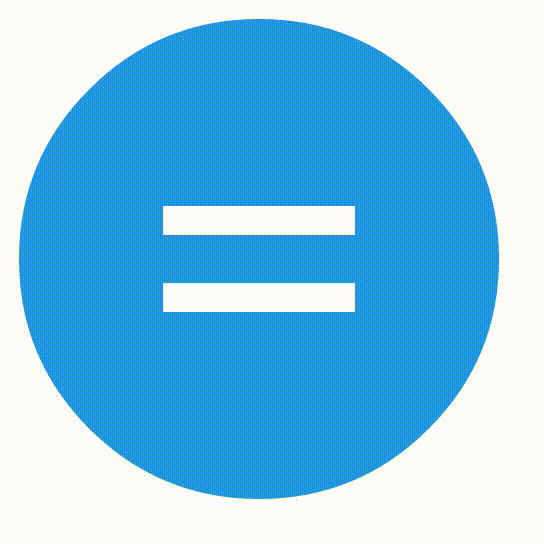

# Animated-material-floatbutton
A floating round material button that has animations between states.

## Screenshot animation


## States
Currently the following icons/states are supported:
* equals
* check 
* min
* cross
* close
* hamburger
* search
* stop
* play
* pause
* arrow-down
* arrow-right
* arrow-left
* arrow-up

## Usage
Be sure to first run a `npm bower install` to get the required libraries. Now simply use the following snippit:

```
<div class="icon-container" data-ripple-color="#ffffff">
    <div class="icon-holder equals">
        <div class="icon-bar bar1"></div>
        <div class="icon-bar bar2"></div>
        <div class="icon-bar bar3"></div>
    </div>
</div>
```

Change the class `equals` to any class you want to use (see States);

## Issues
Play and pause button are a bit funky. Need to find a way to display them without border attributes.