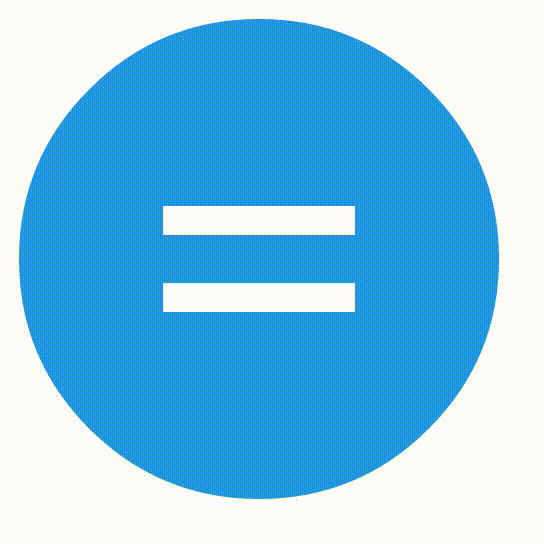

# Animated-material-floatbutton
A floating round material button that has animations between states.

## Screenshot animation


## Demo
[Click here](http://button.dirkjanwassink.nl)

## States
Currently the following icons/states are supported:
* equals
* check 
* min
* cross
* close
* hamburger
* search
* stop
* play
* pause
* arrow-down
* arrow-right
* arrow-left
* arrow-up

## Usage
Either download/clone this repo or install it with bower:
`bower install animated-material-floatbutton`

Simply use the following snippet:

```html
<div class="animated-material-fab">
    <div class="icon-holder equals">
        <div class="icon-bar bar1"></div>
        <div class="icon-bar bar2"></div>
        <div class="icon-bar bar3"></div>
    </div>
</div>
```

For a example check the example dir.

Change the class `equals` to any class you want to use (see [States](#states))

## Ripple
This lib plays pretty nice with a ripple effect library I made. Which is available [here](https://github.com/DJWassink/simple-ripple)
See the example dir for a example on how to combine these.

## Issues
* Play and pause button are a bit funky. Need to find a way to display them without border attributes.
* Changing the scale in Chrome first changes the icon-container (blue circle) and the icon after that.
